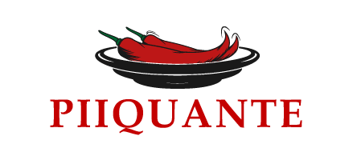

<h2>Projet 6 du parcours "Developpeur Web" pour Openclassroom</h2>

L'objectif est le developpement du Backend du site Web "Piiquante". 
Ce site permet aux utilisateurs de télécharger leurs sauces piquantes préférées et de liker ou disliker les sauces que d'autres partagent.

Le Frontend est fourni dans le projet. 
Ce projet utilise NodeJS. 
MongoDB a été choisi pour la base de données.

<h3>Frontend</h3>
Le front-end de l'application a été développé à l'aide d'Angular. 
Executer 

npm install
 

npm install --save-dev run-script-os
 
<a href="https://github.com/OpenClassrooms-Student-Center/Web-Developer-P6">Le Repositorie Frontend</a> 
Après récuperation du frontend lancer le serveur frontend avec la commande :  

npm start
 

 <h3>Backend</h3> 
 Les dependances NPM suivantes ont été utilisé :
   <ul>
   <li>npm install -g nodemon</li>
   <li>npm install express</li>
   <li>npm install mongoose</li>
   <li>npm install mongoose-unique-validator</li>
   <li>npm install bcrypt</li>
   <li>npm install jsonwebtoken</li>
   <li>npm install dotenv</li>
   <li>npm install multer</li>
   </ul>
 Après récuperation de ce repositorie : 

 <strong>Fichier ".env.dist" :</strong> 
 Ouvrir le fichier ".env.dist" 
 Inserer votre identifiant et mot de passe MongoDB. 
 Renseigner votre chaîne secrète. 
 Modifier l'extension du fichier ".env.dist" par ".env". 
 La connexion à MongoDB sera alors possible. 

Lancer le serveur backend avec la commande : 

nodemon server
 
